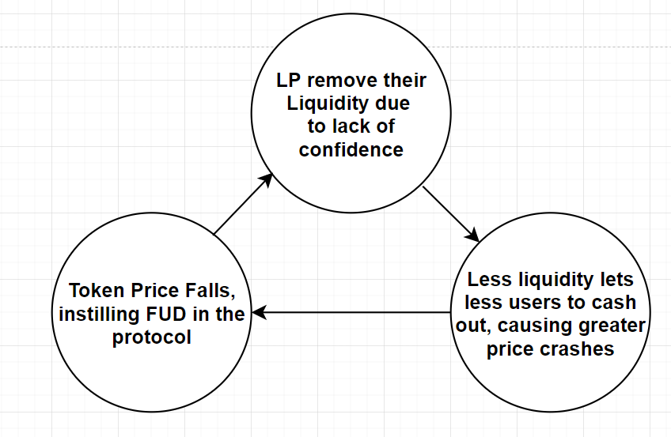

# Introduction

## Summary

Bondii is a DeFi tool by Nahmii that helps tokenised blockchain-based products protect their liquidity - and generate significant revenue while doing so.

Bondii helps protocols acquire their own liquidity. Protocols no longer need to pay out high incentives to rent liquidity, while also guaranteeing the permanence of liquidity to facilitate transactions.

> Bondii solves for liquidity problems by providing bonds-as-a-service for a small fee.

Instead of staking their LP (liquidity provider) tokens for farming rewards in a pool 2, users can **exchange** their LP tokens for the protocol's governance tokens at a discounted rate. This is done through a process called [**Bonding**](nahmii-bonds-users/bonding.md)**.** As the protocol never sells these LP tokens, the liquidity is effectively locked within its treasury.

Today, protocols set aside a large percentage of their token supply in order to incentivise liquidity providers. This negatively impacts the sustainability of the protocol in these ways:

**1. Significant Sell Pressure:** Inflationary token emission incentivises short-term behaviour that increases sell pressure on the farm tokens. Mercenary liquidity providers (LPs) often sell their rewards to recoup their investments. Current solutions, such as time-locked staking, don't solve the core issue at hand and simply prolong the liquidity attrition.

**2. Goal Misalignment between Protocol and LP:** LPs are incentivised by high reward rates, rather than a strong belief in the success of the protocol. Hence, once the LP rewards are exhausted, the LPs will remove their capital and move on to the next opportunity.

**42%** of the yield farmers that enter a farm on the day it launches **exit within 24 hours**. Around **16% leave within 48 hours**, and by the **third day 70%** of these users would have withdrawn from the contract.

**3. Impermanent Loss (IL):** The success of a protocol causes price appreciation in its native token, causing a significant impermanent loss scenario for liquidity providers. This misalignment disincentivizes long-term LPs, even if they're long-term believers in the protocol.

**4: No Buyer of Last Resort:** During a market crash or in times of uncertainty, LPs tend to remove their liquidity from the pool as they are wary of the market state. It's at these moments, however, that the protocol needs liquidity the most.

<figure><figcaption>
Negative flywheel effect during a market crash
</figcaption></figure>

## Benefits of Olympus Pro for Protocols

Why is Bondii superior to traditional liquidity retention approaches?

**1. Protocols now own their liquidity,** rather than relying on mercenary LPs. This ensures permanence of liquidity and provides security for the protocol and its users.

2\. This leads to a **shift in market dynamics**. With pool 2, LPs take farming rewards for granted and because they could come and go as they please, their goal is not aligned with the protocol. With bonds, users are incentivised (through discounted tokens) to help the protocol succeed.

3\. As more liquidity is accumulated, the pool can support larger trades and guarantee **price stability** and **protection from massive liquidity exits.** This in turn creates a healthy price action, attracting long-term holders.

4\. Protocols can unlock **new revenue streams** by capturing liquidity fees as they also become the liquidity providers themselves.

5\. Protocols through their Bondii partnership **gain extra exposure** as their bonds will be featured on the unified marketplace for bonds.

6\. Protocols gain access to **experienced policy and engineering teams** who provide market expertise and ensure success from deployment to maintenance.

## Benefits of Bondii for the Community

Community plays an important role in the sustainability of a protocol. Bondii offers the community:

**1. Opportunities to buy discounted tokens**. Long-term holders do not need to speculate on price action in order to obtain more tokens. Through bonds, they can supply LP tokens to the protocol of their choice in exchange for its native tokens at a discounted rate. This is a win-win scenario for both the token holders and the protocol itself.

**2. No exposure** **to impermanent loss.** Long-term holders aren't incentivised to provide liquidity, as they would experience impermanent loss. Shifting this loss to the protocol better aligns both LPs and the protocol.

**3. Confidence in the liquidity availability.** The community can be assured that the liquidity will permanently reside within the protocol and that there will always be ample liquidity for users to trade their tokens.

