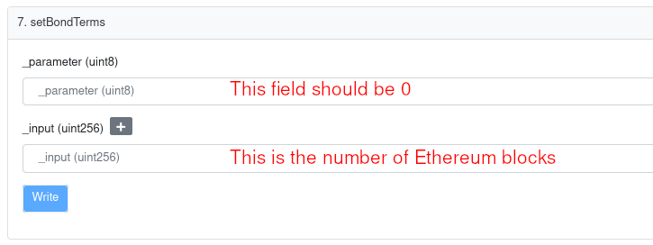
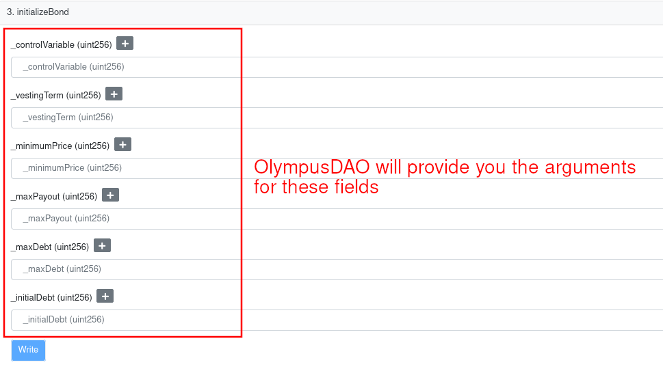

# Getting Started

## Supplying Information to Nahmii

Reach out to us at info@nahmii.io to register your interest in becoming a partner of Bondii.

1. Total pilot emissions (e.g. 1,000,000 ABC token or USD equivalent).
2. Token contract address
3. Token LP contract address

## Launching the Bond Program

Nahmii will work with you to set up the necessary contracts to start the bond program. The following are the high-level action items required by both parties:

**By Nahmii:**

1\. Nahmii will deploy the factory contract, [BondiiFactory](https://explorer.n3g0.nahmii.net/address/0x2b8C013C7FD496A8ff183Ce787288Aa3F2660a38).

2\. Nahmii will use the factory contract to deploy Bondii's `Custom Treasury` and Bondii's `Custom Bond` contracts, with the `owner` set to your **multisig address**.


At this point, you are in full control of the Custom Treasury and Custom Bond contracts.


**By Partners:**

1\. You will call `toggleBondContract` in the Custom Treasury contract and pass in the `Custom Bond` contract address.

2\. You will set the vesting block of the `Custom Bond` contract by calling `setBondTerms`. 46,200 is approximately 7 days.

<figure><figcaption>
The first parameter should be set to 0
</figcaption></figure>

3\. You will transfer your **payout tokens** to the `Custom Treasury` contract. You may send one week or the full term of emissions to your custom treasury.

4\. You will initialise the `Custom Bond` contract. **Initialising the bond will allow bond purchases - this function is only called once.**

| Parameter       | Overview                                        |
| --------------- | ----------------------------------------------- |
| controlVariable | Controls bond price and capacity                |
| vestingTerm     | Vesting term (typically 7 days)                 |
| minimumPrice    | Minimum price of the bond                       |
| maxPayout       | Max payout as a % of total supply               |
| maxDebt         | Ceiling on how many bonds can be outstanding    |
| initialDebt     | Initial debt used for initialising the contract |

<figure><figcaption>
Nahmii will supply the initialisation parameters
</figcaption></figure>

5\. A policy team member from Nahmii will suggest BCV and other relevant parameters to be used. The next section will give you an overview of the adjustments.


Once the Custom Bond contract is initialised, users can start purchasing&#x20;


## Adjusting Bond Control Variables (BCV)

Through a weekly policy meeting with our team, we may suggest changes to the BCV parameter that controls the bond capacity. For example, a higher BCV value translates to a higher bond price, which has an effect of reducing the bond capacity.

Because the partner owns the `Custom Bond` contract, they need to apply the changes themselves. The Nahmii team will provide guidance on the appropriate parameters to use.

To adjust the BCV, call `setAdjustment` function and pass in the appropriate arguments.

<figure><figcaption>
setAdjustment function from the Custom Bond contract
</figcaption></figure>

Overview of the parameters:

| Parameters | Overview                                    |
| ---------- | ------------------------------------------- |
| addition   | Addition/subtraction boolean                |
| increment  | Increment/decrement step of BCV             |
| target     | Target BCV                                  |
| buffer     | Buffer between changes (in Ethereum blocks) |

## Adding New Bond Types

When adding new bond types there are two options:

1\. Create a new `Custom Bond` contract and use the existing treasury. This will only work **if the same payout token is used**.

2\. Create another set of `Custom Bond` and `Custom Treasury` contracts.

If you decide to go with option 1, it is as simple as calling `toggleBondContract` from the `Custom Treasury` contract and passing in the new `Custom Bond` contract address. As before, the bond will have to be initialised. A Nahmii policy member will assist in this as well.


Olympus will create the new`Custom Bond` contract via [BondiiFactory](https://explorer.n3g0.nahmii.net/address/0x2b8C013C7FD496A8ff183Ce787288Aa3F2660a38)


For option 2, you will just follow the steps as outlined in [Launching the Bond Program](getting-started.md#launching-the-bond-program) section.
